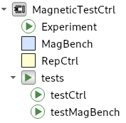
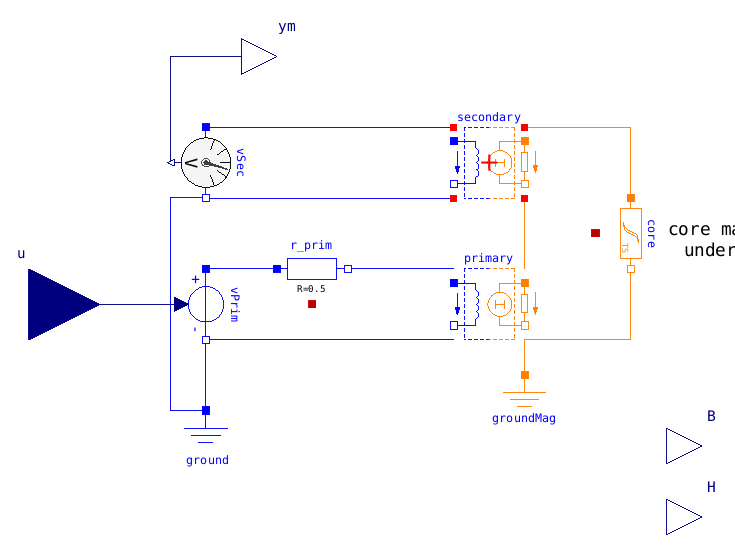
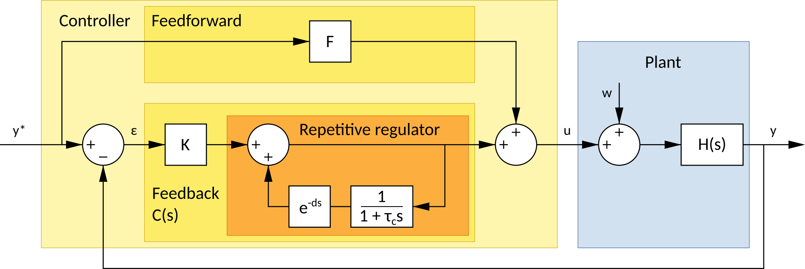

# Repetitive control for magnetic flux control

This repository contains the code and a report on my exploration of
[repetitive control](https://en.wikipedia.org/wiki/Repetitive_control)
and its application to control a test bench for loss measurement of magnetic materials
([Epstein frame](https://en.wikipedia.org/wiki/Epstein_frame)).

This work is a follow-up on a June 2019 discussion with Anh-Tuan Vo and Afef Lebouc
from [G2Elab](http://www.g2elab.grenoble-inp.fr/en)
who are actually working and controlling such a system.
This repository contains [Modelica](https://www.modelica.org/) models of my own
for the numerical simulation of this scheme. A draft report summarizes key results.

Repository address: https://github.com/pierre-haessig/repetitive-ctrl-magnetic

## Repository content

### Report

The draft report [Repetitive control for magnetic test.pdf](Repetitive%20control%20for%20magnetic%20test.pdf)
summarizes some key properties of repetitive control
and shows numerical simulations of this control applied to a magnetic test bench.
Tuning of the control parameters is discussed.

This report is deposited as a draft paper on the HAL archive:

Pierre Haessig, “Repetitive control for magnetic flux control”, 2019.
https://hal.archives-ouvertes.fr/hal-02287247

### Modelica models

Modelica package [MagneticTestCtrl.mo](MagneticTestCtrl.mo), which contains
all simulation models. Package content:
* `Experiment`: simulation model of the repetitive control `RepCtrl`
  connected to the `MagBench` system to be controlled.
* `MagBench`: physical model of the magnetic system, including non-linearities
  (saturation and hysteresis) of the core material under test, based on [Modelica.Magnetic.FluxTubes](https://build.openmodelica.org/Documentation/Modelica.Magnetic.FluxTubes.html) package.
* `RepCtrl`: model of the repetitive controller, including a feedforward
* `tests` subpackage:
  * `testCtrl`: simulation model of `RepCtrl` connected to a simple first order plant model
  * `testMagBench`: simulation model of `MagBench` without a controller

Overview of `MagBench` which models the [Epstein frame](https://en.wikipedia.org/wiki/Epstein_frame) system, including a non-linear magnetic material under test:

### Jupyter Notebooks

Python Notebook [Test Magnetic Control.ipynb](Test%20Magnetic%20Control.ipynb),
which automates some parametric changes in the simulation of Modelica model `testCtrl`.
Requires the [OMPython
](https://github.com/OpenModelica/OMPython) package.

## Repetitive control

Structure of the repetitive control used here:

It is presented in the report [Repetitive control for magnetic test.pdf](Repetitive%20control%20for%20magnetic%20test.pdf)
